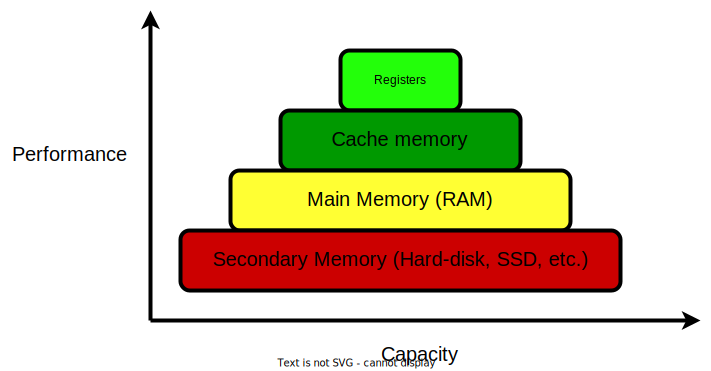

# I/O

The contents of the lab are located in the [lab archive](https://github.com/cs-pub-ro/operating-systems/raw/refs/heads/lab-archives/Lab_11_IO_Optimizations.zip) and in the [GitHub repository](https://github.com/cs-pub-ro/operating-systems).

We know that a compute system is a collection of hardware and software that modifies data.
This data has to come from _somewhere_.
This _somewhere_ is always outside the compute system: files, network packets, radio signals, sensor data.
We'll cover interacting with all of communication channels when discussing **the Linux file interface**.

A compute system without output is essentially useless.
While there are many ways to distribute work across processes and threads, the real benefit comes from efficiently passing data between them.
This is where **Inter-Process Communication** (IPC) methods like pipes, sockets, and file mappings come into play, which we'll explore in detail in the second part.

You saw this hierarchy during the Data lecture:

It says that while the disk can store lots of data, it does so at the cost of speed.
When we say speed, we mean the rate at which we can read/write data from/to the disk, i.e. the maximum number of bytes transferred per unit of time.
This means that `read()` and `write()` syscalls (or their various corresponding library calls) are slow and cause performance bottlenecks.
More often than not, it is the I/O component that drags down the performance of an otherwise fast application.
And what's worse, the further the "destination" of the I/O operation (file on the disk or host on the Web) is, the more time it takes to transfer data to and from it.

On the other hand, as we've already established, the I/O component defines how we interact with an app.
If we want it to be responsive and to do something useful, most likely, the I/O is the key.
So I/O is crucial for most applications, yet it is also the slowest...

But fear not!
There are countless optimisations out there aimed precisely at bridging the speed gap between the memory and the disk.
