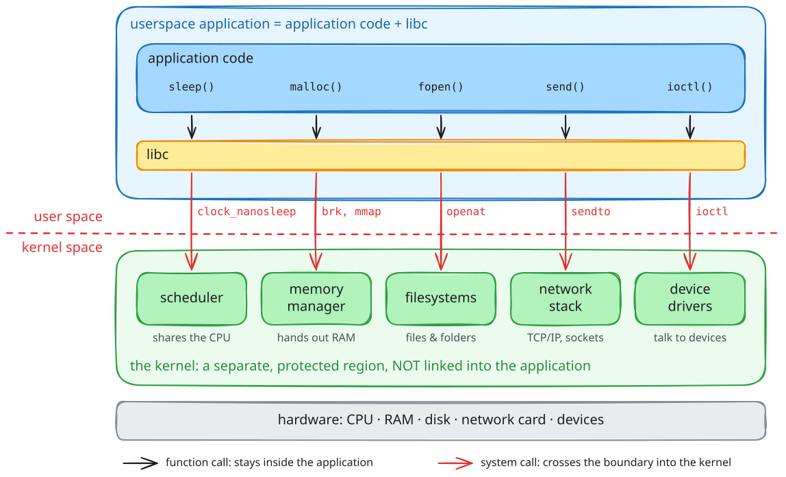
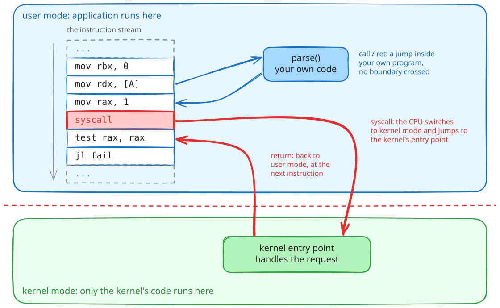
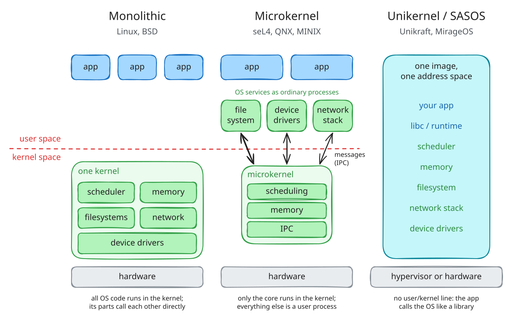
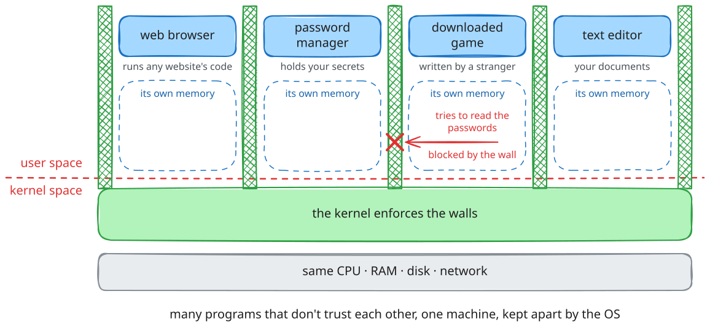
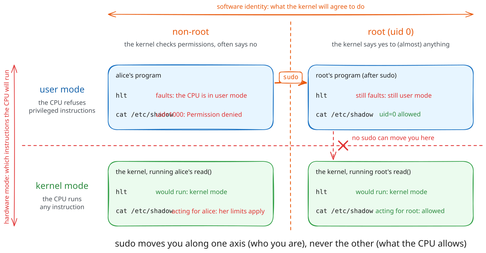
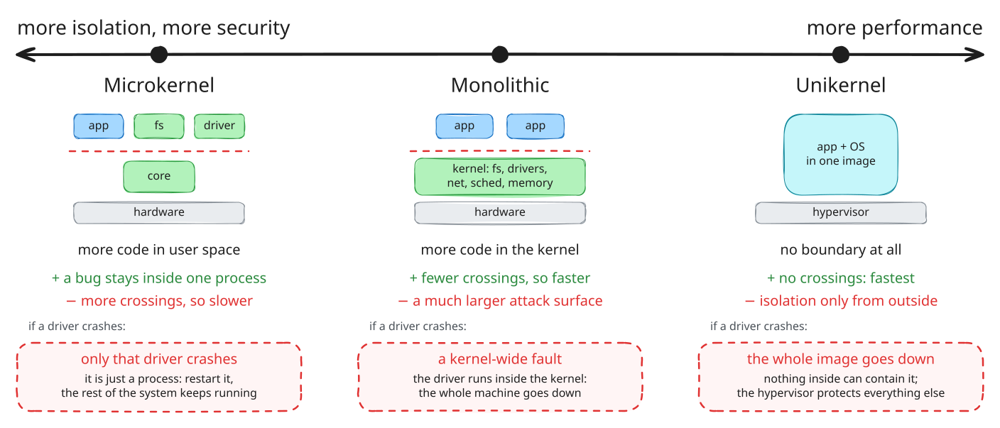
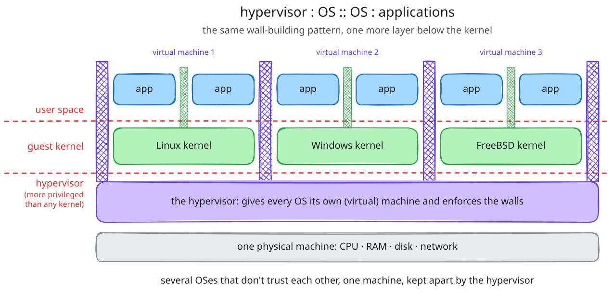

# Session 02: Operating System Types and the OS Interface - Full Contents

This is the complete version of the second lecture: the argument in full sentences, the diagrams, the demos with their reference output, and the reading behind each part.

Read it before the lecture if you want to follow the live delivery without taking notes, and after it for everything that was said once and quickly.
The one-page plan used during the lecture is [`02-os-types-interface-live/`](../02-os-types-interface-live).

Lecture 01 established that software is built in layers and that the operating system is one of them.
This lecture opens that layer up: what an operating system is made of, the interface it offers, the hardware boundary that makes the interface necessary, what that boundary costs, and the design choices -- OS types and virtualization -- that follow from trying to lower the cost without giving up the protection.

## Learning objectives

By the end of this lecture you should be able to:

* Say what an operating system is for, in terms of the features it provides and the isolation it enforces, and explain why it is a library that is not linked into your program.
* Describe the system call interface: what a system call is, the families it divides into, and how libc calls relate to system calls.
* Explain the user/kernel mode boundary, why it is enforced by the hardware, and why it is orthogonal to the root/non-root distinction.
* Account for the cost of a system call, and describe the two directions -- into user space, into kernel space -- in which work is moved to reduce it.
* Compare monolithic, microkernel and unikernel designs as points on a security-against-performance trade-off.
* Explain what virtualization adds, and why a hypervisor is to operating systems what an operating system is to applications.

## What is here

| Part | What it answers | Demos |
| --- | --- | --- |
| [00. Pitch](#00-pitch-why-do-we-need-an-operating-system) | Why is there an operating system at all? | [`00-pitch/`](demos/00-pitch) |
| [01. What makes an OS](#01-what-makes-an-operating-system) | What is an operating system made of? | [`01-make-os/`](demos/01-make-os) |
| [02. The OS interface](#02-the-operating-system-interface) | How does a program ask the kernel for something? | [`02-os-interface/`](demos/02-os-interface) |
| [03. Privileged domains](#03-privileged-and-unprivileged-domains) | What makes the boundary a boundary? | [`03-privileged-domain/`](demos/03-privileged-domain) |
| [04. Optimizing the interface](#04-optimizing-the-os-interface) | The boundary is expensive; how do you pay less? | [`04-optimize-os-interface/`](demos/04-optimize-os-interface) |
| [05. OS types](#05-optimizing-vs-security-os-types) | Where should the code live? | -- |
| [06. Virtualization](#06-virtualization) | What runs the operating system? | -- |
| [07. Conclusion](#07-conclusion) | What should survive the week? | -- |

The slides are in [`slides/`](slides); the demos, with build instructions and reference output, are in [`demos/`](demos).

## 00. Pitch: Why Do We Need an Operating System?

Before any definitions, a measurement.

A C program that prints one line does something on the order of a million machine instructions.
A freestanding assembly program that makes two system calls and exits still does a hundred thousand.
Almost none of those instructions are the program's own.

```text
$ sudo perf stat -e instructions ./hello_nostd
Hello, World!
           108,573      instructions

$ sudo perf stat -e instructions ./hello
Hello World!
         1,015,131      instructions
```

The program wrote a dozen instructions; the machine ran a hundred thousand to a million.
The rest is the operating system: starting the process, mapping its memory, servicing its `write`, tearing it down.
It is there whether you call it or not, and it is doing most of the work.

That is the first reason an operating system exists: **common features**.
Every program needs to start, get memory, read and write files, talk to the network.
None of them should reimplement that, and with an operating system none of them has to; the code is written once, lives below every application, and is reached through one interface.

The second reason does not show up in an instruction count, but it is the more important one: **isolation**.
A machine runs many programs at once, written by different people, some of them hostile, none of them entitled to trust from the others.
Something has to keep each program out of the others' memory, share the CPU and the disk fairly, and stop a single misbehaving program -- or a deliberately malicious one that has hijacked another program's control flow -- from taking down the rest.
That something is the operating system, and it can do it only because the hardware gives it a privilege the applications do not have.

So the operating system has a dual role, and the whole lecture follows from it.
It is a **provider of services**, which is why it has an interface (parts 01, 02, 04).
It is an **enforcer of isolation**, which is why that interface is a guarded boundary and not a function call (part 03), and why the design of the boundary is a trade-off (parts 05, 06).

> **Takeaway.**
> An operating system exists to provide the features every program needs and to keep programs from harming one another.
> The first role makes it an interface; the second makes that interface a boundary.

## 01. What Makes an Operating System

### A library that is not linked in

From an application's point of view, the operating system looks like a library: a set of functions you call to get things done -- open a file, allocate memory, send a packet.



But it is a library with two differences that change everything.

It is **not linked into your program**.
Your code and the kernel's code live in different places, run with different privileges, and are never part of the same address space in the way `libc.so.6` is.
When you "call" the kernel you do not jump to it; you ask the hardware to switch modes and transfer control to it, which is the subject of part 02.



And it is **shared by every program on the machine at once**, which a normal library is not.
That is what forces the isolation role: a linked-in library trusts its caller, because the caller and the library are the same program; the kernel must not trust its callers, because they are all the programs on the system, and some of them are trying to break out.

### There is more OS than you think

The pitch showed how much the kernel does for a program.
The other half of the picture is how much *is* the kernel, even stripped to a single application.

A [unikernel](demos/01-make-os/unikraft) is an operating system compiled down to exactly one program and nothing else -- no support for other applications, no drivers it does not use, no user/kernel split, because there is only one trusted application inside.
It is the smallest an operating system can be.
Built to run one `Hello, World!`, a Unikraft image is still around 240 KB with over 800 symbols.

The lesson is that "run a program on a machine" is a large job before the program does anything: boot the hardware, set up memory, provide a console, offer a minimal C library.
A general-purpose kernel like Linux does all of that for thousands of programs it has never seen, plus drivers for every device, plus a scheduler that shares the machine, plus the interface that lets any program ask for any of it.

### Where the code lives: OS types, briefly

Operating systems differ in how much of that machinery runs with kernel privilege and how much is pushed out into ordinary processes.



* A **monolithic kernel** (Linux, the BSDs) puts the scheduler, memory manager, filesystems, drivers and network stack all in kernel mode, in one address space.
* A **microkernel** (seL4, QNX, MINIX) keeps only the barest core -- scheduling, memory, message passing -- in kernel mode, and runs filesystems, drivers and the rest as ordinary user-space processes that talk to each other by message.
* A **unikernel / SASOS** (Unikraft, MirageOS) collapses the distinction entirely: one application and its operating system share a single address space, with no protection boundary inside, because there is nothing to protect it from.

This is only a first look; part 05 returns to it as a trade-off, once part 03 has established what the boundary costs to cross.

> **Takeaway.**
> The operating system is a library you do not link and cannot trust the way a library trusts its caller, shared by every program at once.
> Even reduced to one application it is substantial, and operating systems differ mainly in how much of it runs privileged.

## 02. The Operating System Interface

### The system call is the interface

A program asks the kernel for something by making a **system call**.
The system call interface is the complete list of things the kernel will do on a program's behalf, and it is the only way in.

On x86-64 Linux a system call is made by loading a call number into `rax`, the arguments into `rdi`, `rsi`, `rdx`, `r10`, `r8`, `r9`, and executing the `syscall` instruction.
The kernel does the work and returns the result in `rax`.
That is the entire mechanism, and the demo in [`demos/02-os-interface/syscalls/`](demos/02-os-interface/syscalls) is a program that uses nothing else:

```text
$ strace ./read_write_syscall
write(1, "Gimme message: ", 15)       = 15
read(0, "hello there\n", 64)          = 12
write(1, "hello there\n", 12)         = 12
exit_group(0)                         = ?
```

No library sits between that program and the kernel; the `syscall` instructions are right there in the source.

### Families of system call

Linux has a few hundred system calls, and they group into a handful of families -- the same families that organise the rest of this course:

| Family | Examples | Lecture |
| --- | --- | --- |
| process and thread management | `fork()`, `execve()`, `clone()`, `wait()` | 06--08 |
| memory management | `brk()`, `mmap()`, `munmap()` | 03--05 |
| file I/O | `open()`, `read()`, `write()`, `close()` | 09--10 |
| network I/O | `socket()`, `connect()`, `send()`, `recv()` | 11 |
| inter-process communication | pipes, signals, shared memory | 10, 12 |

The complete numbered list is in `/usr/include/x86_64-linux-gnu/asm/unistd_64.h`, and `man 2 syscalls` is the index.
Published tables for [x86-64](https://x64.syscall.sh/) and [arm64](https://arm64.syscall.sh/) show how the numbers and registers differ between architectures.

### libc calls are not system calls

Almost no program makes system calls the way that assembly demo does.
Programs call `printf()`, `fopen()`, `malloc()`, and libc turns those into `write()`, `openat()`, `mmap()` -- when, and only when, it has to.

The relationship is worth keeping straight, because it is a common source of confusion:

* Some libc calls are **thin wrappers** around one system call: `getpid()` is essentially just the `getpid` system call.
* Some do **no system call at all**, or only sometimes: `strlen()` and `memcpy()` never enter the kernel; `malloc()` usually just carves from a buffer it already has and calls `mmap()` or `brk()` only when it runs out.
* Some do **many**: a single `printf()` may trigger no system call (the data goes to a buffer) or one `write()` (the buffer flushed), depending on state you cannot see from the call site.

That gap is deliberate and useful, and it is exactly what part 04 exploits.
Because libc decides when to cross into the kernel, it can cross far less often than the program appears to ask.

> **Takeaway.**
> The system call interface is the kernel's complete API, entered through one instruction, and it divides into a few families.
> libc sits on top of it and turns library calls into system calls only when it must, which is why the two must never be conflated.

## 03. Privileged and Unprivileged Domains

### Two modes, enforced by the hardware

The reason a system call is not just a function call is that the kernel can do things your program cannot, and the processor enforces the difference.



The CPU runs in one of (at least) two modes.
**User mode** runs application code; it cannot touch device registers, cannot change the page tables that define who can see which memory, cannot disable interrupts.
**Kernel mode** can do all of it.
Applications run in user mode; the kernel runs in kernel mode; and the boundary between them is not a convention the kernel politely observes -- it is wired into the processor.

The demo in [`demos/03-privileged-domain/`](demos/03-privileged-domain) proves it.
Two programs try to run a privileged instruction -- `cli`, which disables interrupts, and `mov rax, cr3`, which reads the page-table base register -- from an ordinary process:

```text
$ ./cli
first
Segmentation fault (core dumped)
```

The program prints `first`, hits the forbidden instruction, and is killed before it can print `second`.
There is no check for `cli` anywhere in the kernel; the hardware raises a fault the instant a ring-3 program executes it, and the kernel's only involvement is to clean up the process that tried.
This is why the boundary can be trusted: a software check could have a bug that lets something through, but the instruction simply does not execute outside kernel mode.

That controlled crossing is the whole security architecture in one sentence.
A program cannot reach kernel-mode power except through the `syscall` instruction, which lands at one fixed address the kernel chose at boot, where the kernel is waiting to check the request before performing it.
In security terms the kernel is a **reference monitor**: every access to a protected resource goes through it, and it cannot be bypassed.
It is also why a system call costs more than a function call -- the mode switch and the checks are real work -- which is the measurement part 04 starts from.

### Mode is not identity: kernel/user versus root/non-root

The single most common confusion here is between two different things that both sound like "privilege".



**Kernel mode versus user mode** is a *hardware* distinction: which instructions the CPU will execute right now.
**Root versus non-root** is a *software* distinction: which identity the kernel's permission checks see, and therefore which requests it will agree to perform.
They are orthogonal.

* A `root` process still runs in user mode and still faults on `cli`; being root does not let you execute privileged instructions, it lets you make system calls the kernel would refuse to a normal user.
* The kernel running an ordinary user's `read()` is in kernel mode on behalf of a non-root process.

Root is powerful because the kernel trusts it, not because it runs at a higher CPU privilege.
The demo makes this concrete: run `./cli` as root and it crashes exactly the same way, because the axis that forbids `cli` is not the one that `sudo` moves along.

> **Takeaway.**
> The user/kernel boundary is enforced by the processor, not by the kernel's own code, which is why it can be trusted.
> It is a hardware mode, orthogonal to the root/non-root identity that governs what the kernel will agree to do.

## 04. Optimizing the OS Interface

### The boundary has a price

A system call crosses the protection boundary, and the crossing is not free.
The demo in [`demos/02-os-interface/syscall-overhead/`](demos/02-os-interface/syscall-overhead) measures it in the cleanest possible way: ten million `write`s of one byte to `/dev/null`, where the kernel's work is nil, against the same loop with the `write` replaced by a function call that returns immediately.

```text
$ ./make_syscalls
time passed 703224 microseconds

$ ./make_libcalls
time passed 9360 microseconds
```

Roughly seventy times slower, and since `/dev/null` does no work, nearly all of that is the cost of the crossing itself -- the mode switch, the argument checks, the cache and TLB effects.
Hundreds of nanoseconds per call, against a few for a function call.

That is not waste; it is the price of the check from part 03.
But it means a program that makes many small system calls is spending most of its time crossing the boundary rather than doing work, and there are two ways to fix that.

### Down: buffer in user space

The first is to make fewer crossings by batching work in user space and crossing only when you have accumulated enough to make it worthwhile.

The demo in [`demos/04-optimize-os-interface/fwrite/`](demos/04-optimize-os-interface/fwrite) writes ten million bytes one at a time, once through the C library's buffer and once with the buffer switched off:

```text
$ ./fwrite_buffered
time passed 65846 microseconds

$ ./fwrite_unbuffered
time passed 1508197 microseconds
```

With the buffer on, each `fwrite` copies its byte into memory and returns; a real `write` system call happens only when the buffer fills, once every few thousand bytes.
With it off, every byte is its own system call and pays the full crossing.
A few kilobytes of memory buy a twenty-fold speedup, and the program's visible behaviour is identical either way.
This is the same trade-off lecture 01 drew and lab 01 measures, and it is why libc buffers by default.

### Up: push work into the kernel

The second is the opposite move: instead of crossing many times, cross once and hand the whole job to the kernel, so the data never comes up into user space at all.

The demo in [`demos/04-optimize-os-interface/sendfile/`](demos/04-optimize-os-interface/sendfile) serves a 10 MB file over a socket two ways.
`server_write` reads each chunk into a user buffer and sends it back out -- two system calls and two copies per chunk.
`server_sendfile` replaces the loop with a single `sendfile()` that tells the kernel to move the file to the socket directly:

```text
./server_sendfile        # ~1800 us per 10 MB file
./server_write           # ~5900 us per 10 MB file
```

Two to three times faster, because there are thousands fewer crossings and the bytes are never copied into and out of user space.

The two demos are one idea from opposite ends.
Buffering keeps the data in user space and batches the crossings; `sendfile` keeps the data in the kernel and removes them.
Which one applies depends on whether user space needs to see the bytes: if the server had to encrypt the file, only buffering would help.

> **Takeaway.**
> A system call costs hundreds of nanoseconds because of the protection boundary, so performance work is about crossing it less.
> Move work down into user space and batch the crossings, or push work up into the kernel and remove them.

## 05. Optimizing vs Security: OS Types

Part 04 optimised the interface without moving code across the boundary.
The design of an operating system is the same trade-off made structurally: *how much code should live on the kernel side of the boundary in the first place?*



Every piece of functionality -- a filesystem, a network stack, a device driver -- can be put in kernel mode or run as a user-space process.
Putting it in the kernel makes it fast, because using it is a direct call rather than a boundary crossing, and it can touch hardware directly.
Putting it in user space makes it safe, because a bug or a compromise in it is contained by the same isolation that contains any other process, and cannot take down the whole machine.

* A **microkernel** chooses safety.
  Only scheduling, memory and message-passing run privileged; filesystems and drivers are ordinary processes.
  A crashing driver is just a crashing process, and can even be restarted.
  The cost is that every filesystem operation is now inter-process communication -- boundary crossings, the very thing part 04 spent its effort avoiding -- so a naive microkernel is slower.
* A **monolithic kernel** chooses performance.
  Everything runs privileged in one address space, so using a filesystem is a function call, not a message.
  The cost is attack surface and fragility: a bug in any driver is a bug in the most privileged code on the machine, and a single fault can take the system down.
* A **unikernel / SASOS** takes the monolithic choice to its limit for the single-application case: no boundary at all, because there is only one trusted program.
  Maximum performance, and isolation provided from outside instead -- which is exactly what part 06 is about.

There is no correct answer, only a choice about which cost you are paying.
Linux is monolithic and runs most of the world; seL4 is a microkernel and runs where a driver bug must not be able to crash the system, such as aircraft and secure enclaves.

> **Takeaway.**
> An OS type is a standing decision about how much code lives inside the protection boundary.
> More in the kernel buys performance at the cost of attack surface; more in user space buys isolation at the cost of crossings.

## 06. Virtualization

Part 05 left the unikernel needing its isolation supplied from outside.
Virtualization is where it comes from, and it answers three questions the operating system alone does not.



* *What if the operating system itself is faulty or compromised?*
  The kernel is the most privileged software on the machine, so nothing above it can contain it.
  Something below it must.
* *What if one machine must serve many mutually distrusting tenants?*
  Process isolation shares one kernel between them; a kernel bug breaks all of them at once.
  Stronger separation needs a smaller, lower thing to enforce it.
* *What if you want to run several different operating systems on one machine at once?*

A **hypervisor** answers all three by doing for operating systems what an operating system does for applications.
It runs in a mode more privileged than the kernel, gives each guest operating system the illusion of having the hardware to itself, schedules them, and keeps them out of each other's memory -- the same management and arbitration roles from the pitch, one level down.
A guest kernel runs believing it owns the machine; the hypervisor virtualises the machine underneath it.

The parallel is exact and worth stating as such.
The operating system multiplexes one machine among many *processes* and isolates them; the hypervisor multiplexes one machine among many *operating systems* and isolates them.
Each adds a layer of management, arbitration and isolation below the one before, and each does it by being more privileged than what it manages.
It is the same idea as the software stack from lecture 01, extended downward: another interface, hiding another implementation, bought with another boundary to cross.

> **Takeaway.**
> A hypervisor is to operating systems what an operating system is to applications: it multiplexes the hardware, isolates its guests, and runs more privileged than they do.
> Virtualization adds one more layer of the same management-and-isolation pattern, below the kernel.

## 07. Conclusion

The lecture covered:

* why an operating system exists -- to provide common features and to enforce isolation between programs
* what it is made of, and how OS types differ in how much runs privileged
* the system call interface, its families, and how libc calls relate to system calls
* the user/kernel boundary, enforced by the hardware, and how it differs from root/non-root
* the cost of that boundary, and the two directions in which work is moved to reduce it
* OS types and virtualization as the same protection-versus-performance trade-off, made structurally

If one thing survives the week, make it this.

> **Takeaway.**
> The operating system has a dual role -- provider of services and enforcer of isolation -- and its whole design follows from serving both at once.
> Isolation needs a boundary; the boundary is entered through system calls; the boundary costs; and OS types and virtualization are the choices you make about where to put it and how much to cross it.

## Where this goes next

* **Lecture 03** goes inside one of the families named in part 02: memory management, and how the kernel gives each process its own view of memory.
* **Lab 02** turns part 02 and part 03 into practice: writing raw system-call wrappers over a generic `my_syscall()`, building libc-style helpers on top of them, and confirming with `strace` which calls a program really makes.
  Start at [`labs/02-os-interface-full/`](../../labs/02-os-interface-full).

## References

### Standards and manuals

* `man 2 syscall`, `man 2 syscalls`, `man 7 libc`
* `man 7 capabilities` -- the identity side of "who may ask the kernel for what"
* [Linux system call tables: x86-64](https://x64.syscall.sh/), [arm64](https://arm64.syscall.sh/)

### Books

* Remzi and Andrea Arpaci-Dusseau, [*Operating Systems: Three Easy Pieces*](https://pages.cs.wisc.edu/~remzi/OSTEP/) -- the "virtualization" and "persistence" parts cover this lecture
* Michael Kerrisk, *The Linux Programming Interface* -- the reference for the system call API
* Andrew Tanenbaum and Herbert Bos, *Modern Operating Systems* -- the classic treatment of OS types and structure

### Worth reading

* Jochen Liedtke, [*On µ-Kernel Construction*](https://os.inf.tu-dresden.de/pubs/sosp95/) -- the microkernel case, from the person who made it fast
* Anil Madhavapeddy et al., [*Unikernels: Library Operating Systems for the Cloud*](https://anil.recoil.org/papers/2013-asplos-mirage.pdf)
* [Interactive Linux kernel map](https://makelinux.github.io/kernel/map/) -- everything a monolithic kernel contains, on one page
* [The `/dev/null` write in the kernel](https://elixir.bootlin.com/linux/v6.17.1/source/drivers/char/mem.c#L418) -- the cheapest system call, for the overhead demo
