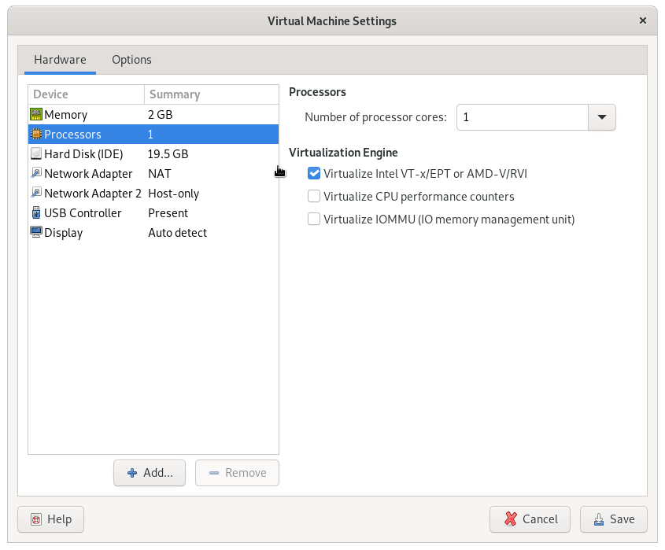
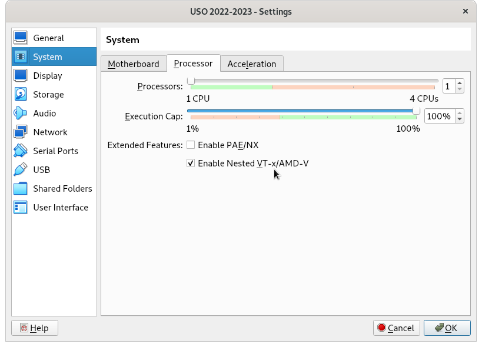
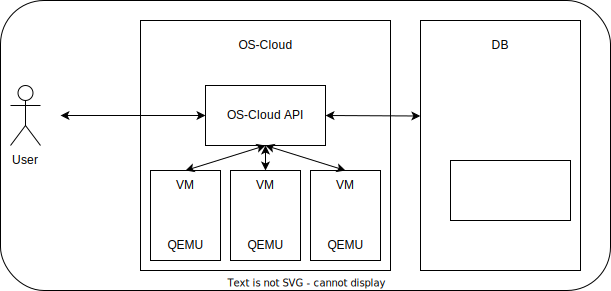

# Read: OS Cloud

In this section, we are going to build a "toy cloud" called `OS Cloud`.
Similar to a real cloud (like `aws`), `OS Cloud` will allow us to create and manage virtual machines, through an `http` API.

## Prerequisites

Make sure the following packages are installed:

```console
sudo apt-get -y update; sudo apt-get -y install docker-compose jq
```

Also, make sure your user can run docker commands.
If not, maybe you need to add it to the `docker` group:

```console
sudo usermod -aG docker student
```

Then, after re-login:

```console
student@os:~$ docker ps
CONTAINER ID   IMAGE     COMMAND   CREATED   STATUS    PORTS     NAMES
```

If you are running inside a virtual machine, you need to enable nested virtualization.
Example for vmware:



For virtualbox:



If the button is greyed out, try from the command line:

```console
student@os:~$ VBoxManage  list vms
"USO 2022-2023" {042a5725-bfb7-4a46-9743-1164d3acac23}

student@os:~$ VBoxManage modifyvm {042a5725-bfb7-4a46-9743-1164d3acac23} --nested-hw-virt on
```

## Initial Liftoff

First, we need to do some initial setup:

```console
student@os:~/.../support/os-cloud$ ./initial_setup.sh
```

Then go to `support/os-cloud` and run:

```console
student@os:~/.../support/os-cloud$ ./setup_db.sh
Setting up db
Starting db server
Waiting for db server to start
...
Stopping db server
Restarting db server
Waiting for db server to start
Creating tables
Stopping db server

student@os:~/.../support/os-cloud$ docker-compose up --build
```

Now the http API will listen on port `localhost:5000`. Let's try:

```console
student@os:~/.../support/os-cloud$ curl localhost:5000
Welcome to OS Cloud!
```

Let's check the running virtual machines:

```console
student@os:~/.../support/os-cloud$ curl localhost:5000/vm_list
[]
```

We got an empty list, since there are no virtual machines yet.
Let's create one (the command will take about 1 minute to complete):

```console
student@os:~/.../support/os-cloud$ curl -H "Content-Type: application/json" \
 -d '{ "name": "my_vm", "image": "ubuntu_22.04", "network": "default", "mem_size": "2G", "disk_size": "10G"}' \
 localhost:5000/vm_create
{"id":1,"status":"ok"}
```

[Quiz](../../quizzes/vm-creation.md)

Check the virtual machine list again:

```console
student@os:~/.../support/os-cloud$ curl localhost:5000/vm_list
[{"id":1,"name":"my_vm"}]
```

We can also use the `jq` tool to pretty print the `json` outputs:

```console
student@os:~/.../support/os-cloud$ curl -s localhost:5000/vm_list | jq .
[
  {
    "id": 1,
    "name": "my_vm"
  }
]
```

We see our newly created virtual machine.
Let's get some information about it:

```console
student@os:~/.../support/os-cloud$ curl -s -H "Content-Type: application/json" -d '{ "id": 1 }' localhost:5000/vm_info | jq .
{
  "disk_size": 10737418240,
  "id": 1,
  "ip": "192.168.0.2",
  "mem_size": 2147483648,
  "name": "my_vm",
  "network": "default",
  "os": "ubuntu_22.04",
  "state": "RUNNING"
}
```

We recognize some parameters that we specified at creation time, like `mem_size` and `disk_size`.
Also, the IP address `192.168.0.2` has been allocated for our machine.

## Virtual Machine Creation

Take a look at the `vm_create` function in `support/os-cloud/os-cloud/vm.py`.
The steps undertaken are roughly:

1. some initial allocations: the virtual machine IP address, network interface, qemu ports, etc

1. the virtual machine disk is created, based on the template specified by the user (like `ubuntu_22.04`)

1. the virtual machine is started with this new disk, in order to do some more customizations (the `ubuntu_22_04_vm_prepare` function)

1. the virtual machine is restarted again with the final disk in place

## Disk Creation

All the disk templates are in `labs/lab-12/tasks/os-cloud/support/disk-templates`.
This directory will be mounted in `/disk-templates` inside the container.

The first step of disk creation is to create a `qcow2` disk file based on the template specified by the user (step 2 from the explanation above).

This is done in the `create_disk_from_template` function in `labs/lab-12/tasks/os-cloud/support/os-cloud/disk.py`.
The function will first create a disk object in the database, then it will call 2 shell scripts: `create_disk_from_template.sh` and `setup_root_password.sh`.

The second step is to start the virtual machine with this disk and do some customizations (step 3 from above).

This is done in the `ubuntu_22_04_vm_prepare` function in `labs/lab-12/tasks/os-cloud/support/os-cloud/vm.py`.
The code will connect to the vm's qemu serial console using `pexpect`.
Then it will use a series of `expect_exact` + `sendline` pairs to interact with the virtual machine, as if those commands were typed in the command-line.

## OS-Cloud: More Disk Customization

You might have probably noticed that there are 2 types of disk customizations:

- One type is for things that can be done without running the virtual machine.
If we only want to modify some files inside the disk filesystem, we can do so by mounting the disk.
This is done, for example, in the `disk-templates/ubuntu_22.04/setup_root_password.sh` script.
There we use `nbd_connect_qcow2` + `mount` to mount the disk, then we modify the `/etc/shadow` file to change the root password.

- The second case is for operations that must be done with the virtual machine running.
These are handled in the `ubuntu_22_04_vm_prepare` function: the virtual machine is first started (`start_qemu_for_vm`), then `pexpect` is used to interact with the virtual machine via the `qemu` serial console.
Here we do things like running `ssh-keygen` - a binary that is part of the disk filesystem, which depends on other parts of the operating system from the disk to be running.
Note that in `ubuntu_22_04_vm_prepare`, for convenience, we also do some customizations that fall into the first category (like modifying `/etc/ssh/sshd_config`).

### Copy Additional Files to the Newly Created Disk

This is a customization from the first category.
In `disk-templates/ubuntu_22.04/files` there is a file called `99-os-cloud-welcome` (a script that prints a greeting message).
We want to copy this file to `/etc/update-motd.d` in our newly created disk, so that it will run whenever a user logs in.

To do this, you will create a script called `copy_files.sh` in `disk-templates/ubuntu_22.04`.
This script will receive a path to a `qcow2` disk file as an argument, it will mount the disk, and then copy the file to the necessary location.
Then, in the `create_disk_from_template` function in `disk.py` you will call this script, similar with how the other scripts are called.

You can use `disk-templates/ubuntu_22.04/setup_root_password.sh` as an example.

### SSH Key Setup

We want to be able to log into the virtual machine using an ssh key, instead of the password `123456`.
Notice that the `vm_create` API also accepts an `ssh_key` parameter.
Here, the user can provide an ssh public key, which the system will install in `/root/.ssh/authorized_keys` in the newly created virtual machine.

Your task is to implement this feature, as a customization from the second category (that is, implemented in the `ubuntu_22_04_vm_prepare` function).
The key will be accessible to the function as the `ssh_pub_key` parameter.
Then it's only a matter of writing the key to the appropriate place, using a command like `echo key > /root/.ssh/authorized_keys`.
Note that the `/root/.ssh` directory might not exist, so you need to create it as well.

After the feature is complete, you can test it using the keys in the `support/os-cloud/keys` directory.
This directory contains a pair of public-private keys.
The directory will also be mounted inside the `os-cloud` container in `/keys`.

You will create another virtual machine, passing the public key to `vm_create`:

```console
student@os:~/.../support/os-cloud$ curl -H "Content-Type: application/json" \
 -d '{ "name": "my_vm2", "image": "ubuntu_22.04", "network": "default", "mem_size": "2G", "disk_size": "10G", "ssh_key": "ssh-rsa AAAAB3NzaC1yc2EAAAADAQABAAABAQC8CDHgeE4NIIIih3wSz58GDkfPLUk2m9gmbZB1f6o8Lzawzb3HVFpslAUWK0f/Ymw9cloInpMo50gWMYFSyJ7ZrOWWak54BedpHDkFAxxy+JCE9b+pkKsrAT7wiir7gn2LHlhj55FLZkC9PpM9cBcrMfzlcP9Bf+2cnpDdINybSLmOUmrI23ANteM4lEVaa2yEbCaJk6dFB8+atz5zPjvVI0Hd+kJK7yJ0xV6Zc2ADle7TKW3dyiXOE9qFKe9933Rj7ocqNXCAO1cxUoJCVuVS7lh+1pSSPXLWLTOhVp/XiLGWVP6KRYmmn710MWKm9Kj1tPiGUphUraL20SJiRT6/ os-cloud-user"}' \
 localhost:5000/vm_create
{"id":2,"status":"ok"}
```

Obtain the IP address that was allocated to the new vm:

```console
student@os:~/.../support/os-cloud$ curl -s -H "Content-Type: application/json" -d '{ "id": 2 }' localhost:5000/vm_info | jq .
{
  "disk_size": 10737418240,
  "id": 2,
  "ip": "192.168.0.3",
  "mem_size": 2147483648,
  "name": "my_vm2",
  "network": "default",
  "os": "ubuntu_22.04",
  "state": "RUNNING"
}
```

Then go inside the `os-cloud` container and ssh to the vm using the private key in `/keys`.
It should work without prompting for the password:

```console
student@os:~/.../support/os-cloud$ docker-compose exec os-cloud bash
root@ac93d3d6cab2:/app# ssh -i /keys/ssh_key root@192.168.0.3
Welcome to Ubuntu 22.04.1 LTS (GNU/Linux 5.15.0-56-generic x86_64)
[...]
Powered by OS Cloud
Last login: Mon Jan  2 19:34:53 2023 from 192.168.0.1
root@ubuntu:~#
```

## OS-Cloud: Internet Access

Notice that our virtual machines don't have Internet access:

```console
Powered by OS Cloud
Last login: Mon Jan  2 19:52:47 UTC 2023 on ttyS0
root@ubuntu:~# curl google.com
curl: (6) Could not resolve host: google.com
```

In this task, we want to fix this problem.
To do this, we must first understand how the networking for the virtual machines is done.

First, there is the concept of a `network`, which you saw in the previous section.
There is a network called `default`, with the address of `192.168.0.0/24`.
All virtual machines are part of this network, that's why they were allocated ip addresses like `192.168.0.2`.

Let's go inside the `os-cloud` container and take a look at the network interfaces:

```console
$ docker-compose exec os-cloud bash
root@8333e5cefb0d:/app# ip a
1: lo: <LOOPBACK,UP,LOWER_UP> mtu 65536 qdisc noqueue state UNKNOWN group default qlen 1000
    link/loopback 00:00:00:00:00:00 brd 00:00:00:00:00:00
    inet 127.0.0.1/8 scope host lo
       valid_lft forever preferred_lft forever
2: br0: <BROADCAST,MULTICAST,UP,LOWER_UP> mtu 1500 qdisc noqueue state UP group default qlen 1000
    link/ether 8a:68:b7:5b:6b:45 brd ff:ff:ff:ff:ff:ff
    inet 192.168.0.1/16 scope global br0
       valid_lft forever preferred_lft forever
3: tap0: <BROADCAST,MULTICAST,UP,LOWER_UP> mtu 1500 qdisc pfifo_fast master br0 state UP group default qlen 1000
    link/ether 8a:68:b7:5b:6b:45 brd ff:ff:ff:ff:ff:ff
4: tap1: <BROADCAST,MULTICAST,UP,LOWER_UP> mtu 1500 qdisc pfifo_fast master br0 state UP group default qlen 1000
    link/ether fa:f8:7f:83:50:8f brd ff:ff:ff:ff:ff:ff
77: eth0@if78: <BROADCAST,MULTICAST,UP,LOWER_UP> mtu 1500 qdisc noqueue state UP group default
    link/ether 02:42:ac:16:00:03 brd ff:ff:ff:ff:ff:ff link-netnsid 0
    inet 172.22.0.3/16 brd 172.22.255.255 scope global eth0
       valid_lft forever preferred_lft forever

root@8333e5cefb0d:/app# ps -ef | grep qemu
root          19       8 29 09:15 ?        00:01:26 qemu-system-x86_64 -m 2048 -hda /vm-disks/1/disk.qcow2 -net nic,macaddr=52:54:00:12:34:00 -net tap,ifname=tap0,script=no -monitor telnet::10001,server,nowait -serial telnet::10002,server,nowait -nographic -enable-kvm
root          29       8 28 09:15 ?        00:01:24 qemu-system-x86_64 -m 2048 -hda /vm-disks/2/disk.qcow2 -net nic,macaddr=52:54:00:12:34:01 -net tap,ifname=tap1,script=no -monitor telnet::10003,server,nowait -serial telnet::10004,server,nowait -nographic -enable-kvm
```

Here we have 2 virtual machines running.
Each virtual machine uses a `tap` interface (the `-net tap,ifname=tap0,script=no` parameter for `qemu`).
This means that the `ens0` interface inside the virtual machine corresponds to the `tap0` interface outside the virtual machine.
All the tap interfaces are bridged together into the `br0` bridge, which has the ip address `192.168.0.1`.
Also, each virtual machine has the default gateway configured to be `192.168.0.1`.

In summary, it looks something like this:


All the traffic coming from the virtual machines passes through the `br0` interface.
So, in order to make the Internet work, all we have to do is a simple `NAT`, with a command like:

```console
root@8333e5cefb0d:/app# iptables -t nat -A POSTROUTING -s 192.168.0.0/24 -j MASQUERADE
```

Now, the virtual machines should have Internet access:

```console
root@8333e5cefb0d:/app# ssh root@192.168.0.2
[...]
root@ubuntu:~# curl google.com
<HTML><HEAD><meta http-equiv="content-type" content="text/html;charset=utf-8">
<TITLE>301 Moved</TITLE></HEAD><BODY>
<H1>301 Moved</H1>
The document has moved
<A HREF="http://www.google.com/">here</A>.
</BODY></HTML>
```

Now your task is to run the `iptables` command above automatically when the system starts, so that it's not necessary to run it manually like we did in the above example.

A good place to do this is in the `create_one_network` function in `network.py`.
There you can add another `subprocess.run` call to run `iptables`.
The `192.168.0.0/24` value should not be hardcoded, but you can take it from the `ip_with_prefixlen` member of the `Net` object.

## Task: Create a New Disk by Hand

Navigate to `labs/lab-12/tasks/os-cloud/support`.
Let's replicate the above-mentioned steps and create a new disk ourselves.

First, we have to call the 2 scripts from the `create_disk_from_template` function:

```console
student@os:~/.../support$ ./disk-templates/ubuntu_22.04/create_disk_from_template.sh ./disk-templates/ubuntu_22.04/ubuntu_22.04.qcow2 my-disk.qcow2 10737418240
Image resized.

student@os:~/.../support$ ls -lh my-disk.qcow2
-rw-r--r-- 1 student student 619M Nov 20 15:41 my-disk.qcow2

student@os:~/.../support$ sudo ./disk-templates/ubuntu_22.04/setup_root_password.sh my-disk.qcow2 123456
```

Now we can start a qemu instance using this disk:

```console
student@os:~/.../support$ qemu-system-x86_64 -enable-kvm -m 2G -hda my-disk.qcow2 -nographic
...
Ubuntu 22.04 LTS ubuntu ttyS0

ubuntu login: root
Password:
...
root@ubuntu:~#
```

Here we can further run customization commands, like the ones in the `ubuntu_22_04_vm_prepare` function, or any other things that we want.

When we're done, we run the `halt` command:

```console
root@ubuntu:~# halt
root@ubuntu:~#          Stopping Session 1 of User root...
[  OK  ] Removed slice /system/modprobe.
[  OK  ] Stopped target Graphical Interface.
...
         Starting System Halt...
[   86.431398] reboot: System halted
```

When the `System halted` message is printed, press `CTRL+A X` to exit qemu (that is, press `CTRL+A`, release `CTRL` and `A`, press `X`).

## Task: Implement `vm_stop`

The `vm_stop` command will stop a particular virtual machine, meaning it will stop the qemu process for that vm.
The implementation starts in `api_vm_stop` in `app.py`, which is the function that handles the `http` request for the stop operation.
Here you need to do the following:

- extract the virtual machine `id` from the request

- use the `vm.vm_get` function to convert this ID into a `VM` structure

- call `vm.vm_stop` and pass the `VM` object to it

In `vm.vm_stop`:

- call `stop_qemu_for_vm`

- change the vm pid in the database to `-1`

- change the vm state in the database to `VM_STATE_STOPPED`

After modifying the code, you should run `docker-compose up --build` again.
Also, if your database became inconsistent, you can clean it up by re-running the `setup_db.sh` script.
Then delete all vm disks with `sudo rm -rf vm-disks/*`.

With `vm_stop` implemented, the system should work like this:

```console
student@os:~/.../support$ curl -s localhost:5000/vm_list | jq .
[
  {
    "id": 1,
    "name": "my_vm"
  }
]
student@os:~/.../support$ curl -H "Content-Type: application/json" -d '{ "id": 1}' localhost:5000/vm_scurl -s -H "Content-Type: application/json" -d '{ "id": 1 }' localhost:5000/vm_info | jq .
{
  "disk_size": 10737418240,
  "id": 1,
  "ip": "192.168.0.2",
  "mem_size": 2147483648,
  "name": "my_vm",
  "network": "default",
  "os": "ubuntu_22.04",
  "state": "RUNNING"
}
```

The vm is in the `RUNNING` state.
Now let's stop it:

```console
student@os:~/.../support$ curl -H "Content-Type: application/json" -d '{ "id": 1}' localhost:5000/vm_stop
{"status":"ok"}
student@os:~/.../support$ curl -s -H "Content-Type: application/json" -d '{ "id": 1 }' localhost:5000/vm_info | jq .
{
  "disk_size": 10737418240,
  "id": 1,
  "ip": "192.168.0.2",
  "mem_size": 2147483648,
  "name": "my_vm",
  "network": "default",
  "os": "ubuntu_22.04",
  "state": "STOPPED"
}
```

Now the state is `STOPPED`.
Inside the container, the qemu process should be gone as well:

```console
student@os:~/.../support$ docker-compose exec os-cloud bash
root@b0600eff8903:/app# ps -ef
UID          PID    PPID  C STIME TTY          TIME CMD
root           1       0  0 10:00 ?        00:00:00 /sbin/docker-init -- python3 -u app.py
root           7       1  0 10:00 ?        00:00:00 python3 -u app.py
root          33       0  0 10:00 pts/3    00:00:00 bash
root          41      33  0 10:00 pts/3    00:00:00 ps -ef
```

Finally, the vm can be started again using `vm_start`:

```console
student@os:~/.../support$ curl -H "Content-Type: application/json" -d '{ "id": 1}' localhost:5000/vm_start
{"status":"ok"}
```

If you're having difficulties solving this exercise, go through [this](lab12.md#os-cloud) reading material.

## More Implementation Details

The application consists of 2 containers:

- `db`, which runs a `MySQL` database

- `os-cloud`, which runs the web application and the virtual machines

Let's check them.
After running `docker-compose up`, in another terminal run `docker-compose ps`:

```console
student@os:~/.../support/os-cloud$ docker-compose ps
       Name                      Command              State                    Ports
------------------------------------------------------------------------------------------------------
os-cloud_db_1         docker-entrypoint.sh mariadbd   Up      3306/tcp
os-cloud_os-cloud_1   python3 -u app.py               Up      0.0.0.0:5000->5000/tcp,:::5000->5000/tcp

```

Now let's move inside the `os-cloud` container:

```console
student@os:~/.../support/os-cloud$ docker-compose exec os-cloud bash
root@89a986d2526e:/app#
```

Since the virtual machines run inside this container, we should expect to see the one that we created in the previous step.

```console
root@89a986d2526e:/app# ps -ef | cat
UID          PID    PPID  C STIME TTY          TIME CMD
root           1       0  0 09:02 ?        00:00:00 /sbin/docker-init -- python3 -u app.py
root           7       1  0 09:02 ?        00:00:00 python3 -u app.py
root          12       7  6 09:02 ?        00:00:41 qemu-system-x86_64 -enable-kvm -m 2048 -hda /vm-disks/1/disk.qcow2 -net nic,macaddr=52:54:00:12:34:00 -net tap,ifname=tap0,script=no -monitor telnet::10001,server,nowait -serial telnet::10002,server,nowait -nographic
root          27       0  0 09:11 pts/3    00:00:00 bash
root          35      27  0 09:13 pts/3    00:00:00 ps -ef
```

Indeed, a `qemu-system-x86_64` process is there.
The vm should be accessible via `ssh` on the IP `192.168.0.2` with password `123456` (if you get `connection refused` here, you need to wait a bit more for the machine to boot):

```console
root@adf6e0bf4e6e:/app# ssh root@192.168.0.2
The authenticity of host '192.168.0.2 (192.168.0.2)' can't be established.
ED25519 key fingerprint is SHA256:3Mfa1fB9y4knUDJWEmEOTz9dWOE7SVhnH/kCBJ15Y0E.
This key is not known by any other names
Are you sure you want to continue connecting (yes/no/[fingerprint])? yes
Warning: Permanently added '192.168.0.2' (ED25519) to the list of known hosts.
root@192.168.0.2's password:
Welcome to Ubuntu 22.04 LTS (GNU/Linux 5.15.0-40-generic x86_64)

...

Last login: Thu Nov 17 07:49:55 2022
root@ubuntu:~#
```

The vm is also accessible on the serial console (notice the `-serial telnet::10002,server,nowait` argument to qemu).
If we start a telnet connection on port `10002`, qemu will show us the virtual machine's serial console (basically the output that we normally see when running a virtual machine in text mode)

```console
root@adf6e0bf4e6e:/app# telnet localhost 10002
Trying 127.0.0.1...
Connected to localhost.
Escape character is '^]'.

ubuntu login: root
Password:
Welcome to Ubuntu 22.04 LTS (GNU/Linux 5.15.0-40-generic x86_64)

...

Last login: Thu Nov 17 07:50:11 UTC 2022 from 192.168.0.1 on pts/0
root@ubuntu:~#
```

To exit the serial console, press `CTRL+]`, then type `quit`:

```console
root@ubuntu:~#
telnet> quit
Connection closed.
root@adf6e0bf4e6e:/app#
```

## (Even) More Implementation Details

The architecture of the system can be summarized in the following diagram:



The `os-cloud` container is the core of the entire system.
It consists of a web application written in python using `flask`.
This web application exposes a virtual machine `API` that the user can interact with (like `vm_create`).

So, when we're calling `curl` like in the example above:

```console
curl -H "Content-Type: application/json" \
 -d '{ "name": "my_vm", "image": "ubuntu_22.04", "network": "default", "mem_size": "2G", "disk_size": "10G"}' \
 localhost:5000/vm_create
```

It will do an `HTTP POST` request (because of the `-d` parameter) to `/vm_create`.
The request will be handled by the `